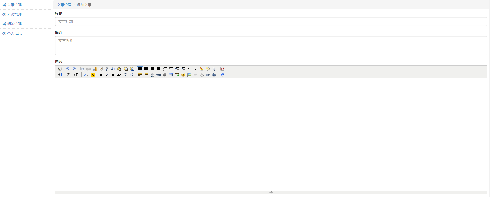

# 博客管理系统
## 模块安装
pip install Django=1.11.12
pip install pillow
pip install PyMysql
### 实现功能
通过bootstrap和jquary实现页面的展示
自定义注册 头像上传与显示 通过pillow模块实现图片验证码验证
自定义登录 通过sessiopn和装饰器保持会话
自定义分页组件 实现页面的分页展示
通过django-orm的聚合函数实现标签分类时间的展示
通过KindEditor 插件实现文章的编辑
自定义xss防攻击插件实现文章的添加
###效果展示
#### 注册

#### 主页

#### 博客

#### 后台

#### 编辑

